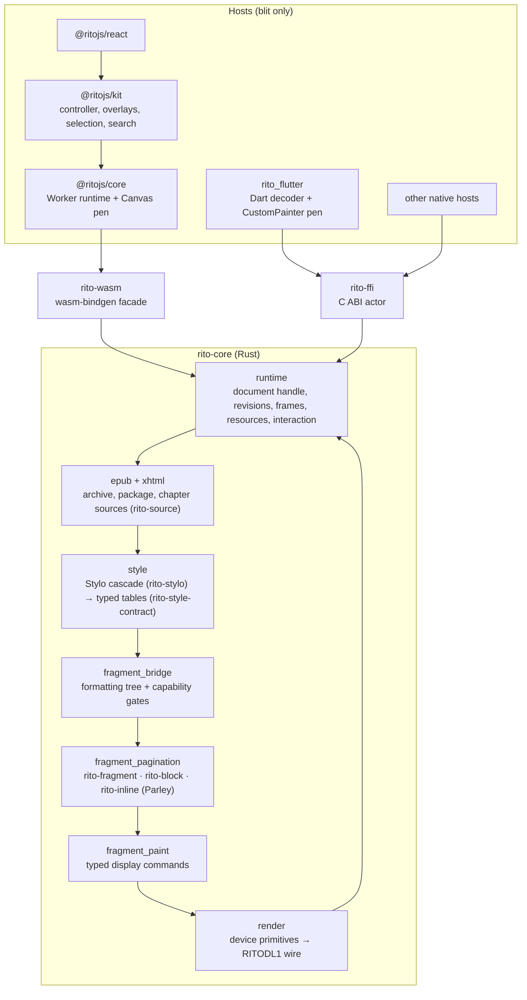

# Rito

A Rust EPUB reader engine with web, Flutter and C ABI hosts.

Rito opens EPUB archives, resolves CSS through Stylo, lays chapters out
with its own fragment engine (Parley-backed inline text, block flow and
pagination) and lowers every page to a device-resolved display list that
hosts blit without interpreting. Layout and paint are measured against
pinned Chromium page by page; the target is pixel identity.

The repository ships:

- `@ritojs/core` — the browser reader: the engine as WASM in a Worker plus
  a Canvas presenter
- `@ritojs/kit` — a framework-agnostic controller with transitions,
  overlays, selection, search, annotations, keyboard and storage
- `@ritojs/react` — React hooks and a mount component over core and kit
- `rito_flutter` — the Flutter adapter over the engine's C ABI (pub.dev)
- `crates/rito-ffi` — the C ABI for other native hosts

## Architecture

One Rust engine parses, styles, lays out and paints every page. Hosts move
its bytes and blit them; no host owns a layout or paint rule.



Every layout and paint rule is proven against pinned Chromium page by
page. The crate and package boundaries, the invariants and the guards
that enforce them are in [Architecture](./docs/development/architecture.md)
and [Engine Pipeline](./docs/development/engine-pipeline.md).

## Install

```bash
pnpm add @ritojs/core
```

## Quick Start

```ts
import { createReader } from '@ritojs/core';

const response = await fetch('book.epub');
const canvas = document.querySelector('canvas')!;

// The engine shapes text with pinned font bytes (no system font is
// reachable inside the WASM runtime) — a pinnedFontPolicy is required.
// See docs/getting-started.md for a complete loader.
const reader = await createReader(await response.arrayBuffer(), canvas, {
  width: 800,
  height: 600,
  margin: 40,
  spread: 'double',
  pinnedFontPolicy: await loadPinnedFontPolicy(),
});

reader.renderSpread(0);
console.log(`${reader.totalSpreads} spreads, ${reader.toc.length} TOC entries`);

reader.dispose();
```

## Documentation

- [Documentation Index](./docs/README.md)
- [Getting Started](./docs/getting-started.md)
- [Reader API](./docs/api/reader.md)
- [Migrating to 3.0](./docs/migration/v3.md)
- [Migrating to 2.0](./docs/migration/v2.md)
- [Capabilities](./docs/capabilities.md)
- [Limitations](./docs/limitations.md)
- [Using `@ritojs/kit`](./docs/integrations/kit.md)
- [Using `@ritojs/react`](./docs/integrations/react.md)
- [Direct FFI integration](./docs/integrations/ffi.md)
- [Development Docs](./docs/development/README.md)

## Scope

Rito is optimized for EPUB book layout, not browser-equivalent web layout.

- EPUB-first rendering model with a reading-system UA stylesheet
- one engine for every host: the same page on web, Flutter and native
- a small, stable reader API on the main `@ritojs/core` entry
- a deliberate CSS and layout subset focused on paginated books; what the
  engine cannot honour is degraded with a recorded reason or fails closed

See [Capabilities](./docs/capabilities.md) and
[Limitations](./docs/limitations.md).

## Development

```bash
pnpm install
pnpm run check
```
